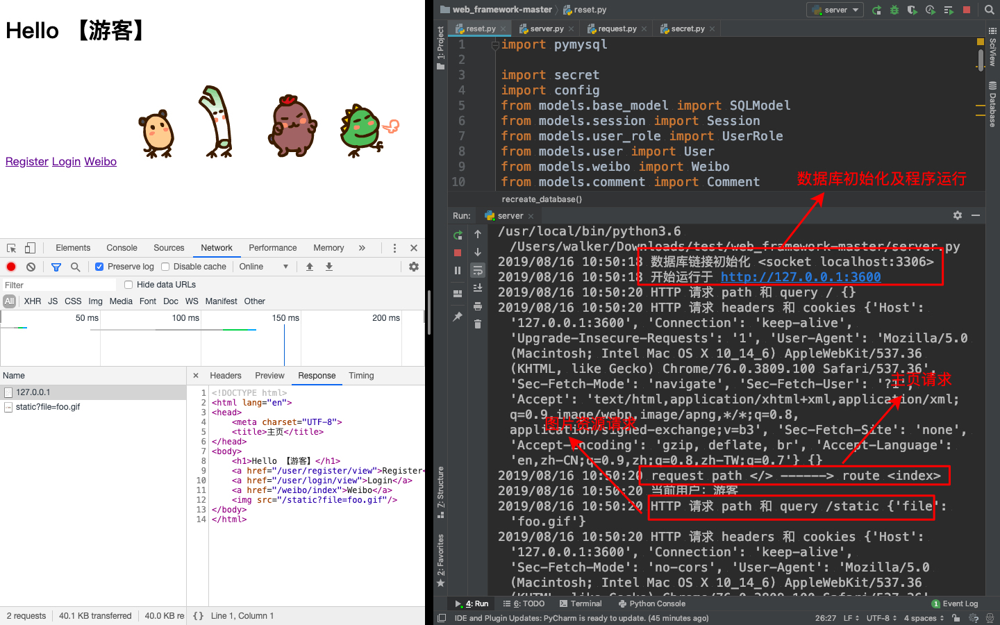

# web_framework 

### 简介

- 使用 Socket 实现 Web 服务器监听端口，解析请求及作出响应 
- Model 部分，由基于 MySQL 自制的 ORM 构成，实现了数据的增删改查 
- Controller 部分，由自制的 Web 框架构成，实现了请求解析，路由分发，请求响应等 
- View 部分，由 Jinja2 模板结合 HTML 构成，实现了便于渲染的显示部分 
- 基于此框架，实现了微博和评论的 CRUD、操作权限验证、密码加盐 Hash 等

### 运行环境

* macOS
* Python3.6
* `pip install pymysql jinja2`

### 本地运行

1. 添加必要文件

   1. 主目录 添加 secret.py
   2. 输入本地数据库密码

2. 执行如下文件
   - `python3 reset.py`
   - `python3 server.py`

### 预览

#### 主页

#### 登录

#### 微博CRUD

